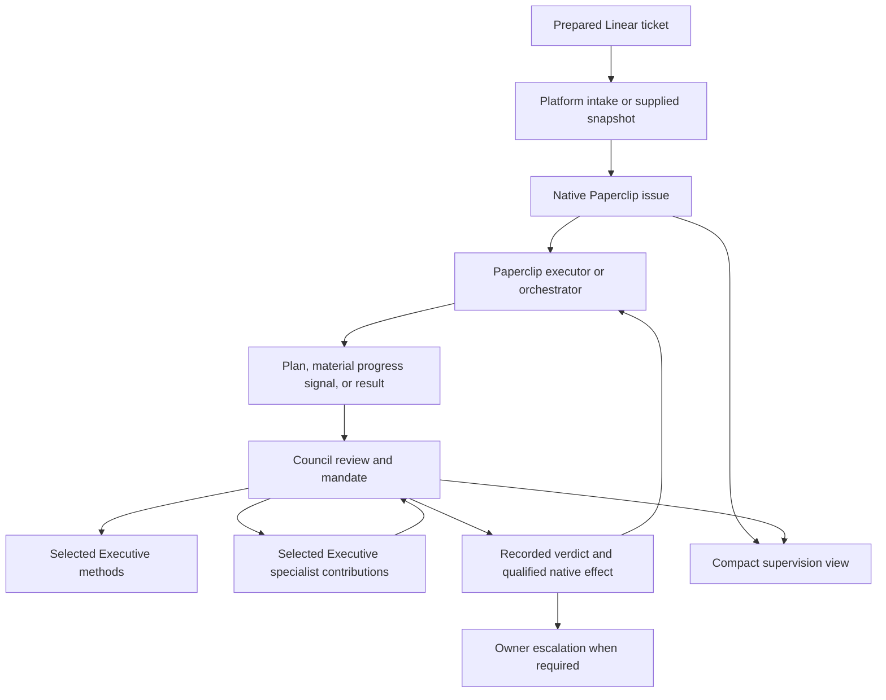

# Paperclip Executive — Technical Architecture Document

Version: 0.3 — September 30, 2026.

Status: revised architecture derived from PRD 0.3; supervision contracts are
proposed and require implementation and runtime qualification.

## 1. Authority, baseline, and change from version 0.1

The [PRD 0.3](PRD.md) owns product requirements. This TAD covers B03 (proportionate
execution direction), B04 (in-flight drift response), and B05 (bounded result review)
for a prepared software development ticket. Council supervision is now central.
Version 0.1's AD-10, manual and Council-independent H1, is explicitly superseded.
Historical B01 advice and B02 broad initiative coordination are not relabeled as
implemented supervision. The existing advice feature may remain available.

This revision aligns agent preparation with the canonical catalogue and its L03
merge dependency. [Roadmap 0.1](ROADMAP.md) still contains the earlier
horizons; its Council deferral and B01/B02 ordering do not govern this design.
The L02 sprint plan remains historical; the current backlog records the agents prerequisite.

| Source | Baseline | Evidence boundary |
| --- | --- | --- |
| Executive | `ccd02e1f594b5fe6083d4c2f1c1ad7533bc7f54e` (L02 PR #4); [L02 report](IMPLEMENTATION-L02.md), manifest and worker. Historical L01 base: `6b157f8`. | Direct advice and prepared-ticket contribution through native sessions; L02 evidence remains scoped, with no Council decision integration. |
| Product requirements | PRD 0.3 in this change | Owner's clarified direction; not runtime evidence. |
| Council | [PRD 0.3 at `bc6d71f`](https://github.com/ty000/paperclip-council/blob/bc6d71fa6ede8f239c7990af1885dc07cccc7c18/docs/PRD.md) | Supervision responsibilities, acceptance semantics, proportionality, and owner-specific delegation rules; no assumed integration API. |
| Paperclip | `61b3fd57a695614dc4a37e2303f426a34a9795cf` | Native contracts documented from the prior source inspection; source references retained below, not a fresh deployed-host audit. |
| OpenExecutive | `13da433bc6f3ae97e78bb8c90f06bb5e49953447` | Candidate instructions and methods, not a backend dependency. |

**Existing** refers to source or the explicitly scoped L01 report. **Proposed**
refers to this architecture. **Qualification required** means behavior must be
proved on the chosen host and Council revision. No models, services, or agents
were activated for this revision; prior bridge trials do not qualify this design.

## 2. Architectural decisions

The AD identifiers are retained; wording is revised for the new journeys.

| ID | Decision | Reason and trade-off | PRD trace |
| --- | --- | --- | --- |
| AD-01 | Retain the external native TypeScript plugin and small host UI. | Reuse L01 packaging; no Python backend or second project platform. | EXE-06, EXE-12 |
| AD-02 | Run model work through Paperclip agents/sessions. | Preserve visible identities and run records; no hidden provider loop in the worker. | EXE-02, EXE-08 |
| AD-03 | Executive produces contributions; Council owns the mandate, verdict, and decision effect. | Prevent two acceptance authorities; model text never directly grants permission. | EXE-05, EXE-06, EXE-15 |
| AD-04 | Native issues own work; Council owns supervision records; Executive stores only bindings, input snapshots, contributions, and dispatch correlation it needs. | Avoid a second initiative/task/acceptance system. | EXE-01, EXE-04, EXE-06 |
| AD-05 | Persist before dispatch; use revision checks, stable operation keys, and readback. | No cross-system transaction is assumed; ambiguous outcomes require reconciliation. | EXE-08, EXE-09, EXE-15 |
| AD-06 | Apply verdict effects through the qualified Council/native path under its authenticated actor. | Executive must not reproduce Council's decision writer or fall back to privileged SDK writes. | EXE-05, EXE-15 |
| AD-07 | Use bounded context packets and selected methods, without vector storage. | A prepared ticket supplies the initial context; no upstream memory stack required. | EXE-01, EXE-10, EXE-11 |
| AD-08 | Bind existing agents first; provision selected profiles separately from activation and preserve customizations. | Prepare distinct product, engineering, quality, delivery and economic contributors; bind identities separately from activation. | EXE-02, EXE-11, EXE-12 |
| AD-09 | Extend the existing plugin page with a compact supervision view and native issue/Council links. | Show decisions and next actions without a parallel project board. | EXE-12, EXE-16 |
| AD-10 | Use bounded execution checkpoints and material signals for supervision, with automatic continuation only inside the mandate. | Replaces manual Council-independent H1; avoids both final-review-only detection and constant model polling. | EXE-03, EXE-09, EXE-13 |
| AD-11 | Start at an existing Paperclip issue with a supplied Linear source snapshot/reference. | Prove supervision before automating intake; full Linear synchronization stays outside Executive. | EXE-01, EXE-06 |
| AD-12 | Budget review as well as execution and persist stopping counters. | Council must not recreate the low-value loops it is meant to prevent. | EXE-09, EXE-14, EXE-16 |

Rejected starting points: full OpenExecutive port, mandatory executive panel,
custom Codex CLI adapter, prompt-only authority, an independent Executive verdict
engine, generic retry infrastructure, and a new scheduler merely to trigger reviews.

## 3. Components and responsibility boundaries

| Component | Owns | Does not own |
| --- | --- | --- |
| Intake integration | Linear-to-Paperclip mapping and source capture; later synchronization if selected. | Review decisions or Executive-specific authority. |
| Paperclip execution | Native issue lifecycle, assigned implementation runs, progress evidence. | Self-acceptance of executor output. |
| Council | Canonical mandate, review identity, findings, decisions, correction counters, stopping policy, application and readback of effects. | Implicit merge/deploy authority or unqualified alternate-path guarantees. |
| Executive package | Adapted profiles/methods, bounded contribution production, provenance, and an inspection surface. | A second Council, automatic hiring, or competing acceptance records. |
| Executive worker | Validated context preparation, optional contribution dispatch, persisted operation correlation and result references. | Provider SDK calls, native issue mutation on behalf of Council, or authorization inferred from text. |
| Host | Authentication, company isolation, permitted storage/reads, sessions, run controls and budgets where supported. | Automatic enforcement of every proposed mandate or cost cap. |

A Council reviewer can directly use selected Executive methods. A separate Executive
synthesis agent is not mandatory. Where Council already schedules consultations,
it remains the only scheduler for those calls; the integration must designate one
dispatch owner and never let both systems launch the same contribution.

The initial integration binds existing executor/reviewer identities and requires
them to differ. Additional advisors are attributable but do not acquire verdict
authority through their titles. The owner remains the escalation destination.

Plugins and their UI are trusted code, not a sandbox for arbitrary execution [PC01].
Manifest capabilities and role prompts alone do not establish runtime containment.

## 4. Proposed exchange contracts

These are semantic contracts to implement and qualify, not claims that Council
already exposes endpoints with these names. Prefer its existing contract where it
satisfies the requirement; record any missing host/Council work as an explicit
dependency rather than silently expanding this repository's scope.

| Contract | Minimum content | Owner and checks |
| --- | --- | --- |
| Ticket context | Company/project/issue IDs; Linear ID/URL; source revision or snapshot hash; objective; criteria; exclusions; dependencies; permitted evidence references. | Intake supplies it; the recipient verifies company and authorized resources. A URL alone is insufficient context. |
| Supervision binding | Council reference; executor/reviewer IDs; mandate ID/revision; allowed actions; limits; stopping policy; owner destination; covered native workflow. | Council is canonical. Executive stores references and an observed revision, not an independently editable mandate. |
| Checkpoint | Stable trigger ID; kind `plan`, `progress`, or `result`; issue/run; context and mandate revisions; reason; progress/evidence references; known usage and missing measurements. | Authenticated execution/host source; correlation and deduplication precede any model call. |
| Review subject | Checkpoint plus exact result reference/version and evidence set; repository/commit and artifact identity when reviewing code. | Council checks the current subject before recording and applying a verdict. A mutable branch name alone is insufficient. |
| Contribution request/result | Review ID; question; selected perspective; permitted context; session/run; attempt; attributable finding, rationale, evidence, assumptions and limitations. | Executive validates terminal structured output; no recursive specialist fan-out. |
| Council decision observation | Canonical decision ID/revision; subject; authorized actor; outcome; findings; next action; application status and readback reference. | Council owns recording/application. Executive can display a verified observation but cannot manufacture acceptance. |

Conceptual outcomes include proceed within mandate, correction required, accepted,
escalate, or suspend. Map them explicitly to the selected Council/native API during
implementation; do not assume five existing native verdict values. Deferred
suggestions are findings, not a separate acceptance verdict.

A finding carries its classification (`must_fix`, `useful_now`, `defer`), criterion
or material risk, evidence, consequence, and smallest sufficient action. Council
must validate that a requested correction remains within the mandate. A malformed
or incomplete result is a visible failed contribution, not an implicit approval.

Treat ticket descriptions, attachments, agent text, and external content as evidence,
not instructions capable of expanding permissions. Include only the authorized
context required for the review; preserve references for further permitted inspection.

## 5. Checkpoints, correction, and automatic continuation

### 5.1 Normal path

1. Bind the existing issue and captured ticket context to the Council mandate.
   Check identity separation, required limits, owner destination and path readiness.
2. Persist and review the executor's short plan (B03). Use the catalogue's proposed distinct opinions and one accountable Council
   reviewer;
   explicitly omit irrelevant expertise and enforce the selected consultation limits.
3. Release a bounded execution segment only after the applicable direction is
   recorded and its continuation effect is confirmed. Execution remains native.
4. At a material checkpoint, evaluate deterministic triggers before scheduling
   another review. Persist the trigger, context version and consumed limits.
5. For B04, review only what could change the next action. Continue, select a
   smaller correction, or escalate within the remaining envelope.
6. For B05, review the exact submitted result and evidence. Apply the Council
   decision through its qualified path and read back the native state.
7. On correction, retain the criteria and prior findings, increment the canonical
   correction counter, and review the changed result and affected behavior.

No correction, continuation, or acceptance is reported as applied solely from an
agent's summary. External merge, publication, deployment and Linear status writeback
remain separate integrations and authorities.

### 5.2 Trigger and limit enforcement

| Signal | Source/control required | Response |
| --- | --- | --- |
| Plan or final result | Persisted execution checkpoint for the selected issue/run. | One review for the identified subject. |
| Material scope/design change or blocker | Executor/orchestrator checkpoint with supporting evidence. | Reassess the affected direction; no silent criteria rewrite. |
| Repeated failure or lack of progress | Persisted attempt/correction history and evidence comparison at segment boundaries. | Compare marginal value; simplify or escalate instead of replaying indefinitely. |
| Approaching elapsed-time or resource limit | Host run control/budget signal or bounded segment deadline enforced outside model instructions. | Review before another segment; do not launch work beyond the remaining envelope. |
| Missing progress or stalled run | Qualified timeout/watchdog/control supplied by the host or orchestrator. | Expose stalled/in-flight state; use a supported stop path or operator escalation. |

Choose the concrete signal mechanism against the target host. Do not invent a
subscription API or introduce a permanent scheduler here. A bounded segment must
have an independently enforced maximum duration; relying on an agent to voluntarily
report that it has run too long does not qualify B04. If the required control is
unavailable, mark this path unready and expose the dependency.

Persist limits for correction cycles, consultation count, output repair attempts,
concurrent calls, elapsed execution/review time, and available usage. Start with one
dispatch owner and serial execution/review segments for the reference ticket; keep
consultations serial too. Council owns the envelope. Use its canonical revision
check to claim the next attempt and consume its allowance before dispatch; an
Executive cache cannot authorize another attempt. Do not build a general shared
budget service for this slice. Concurrent dispatch, if later selected, requires
qualified atomic reservation before claiming a shared cap.

Numeric thresholds are set with the owner for the reference case. Optional
consultations end when their bounded value or budget is exhausted. A required review
that cannot complete becomes a blocker. Starting a new session, changing an agent,
or retrying delivery does not reset correction or resource counters. A semantic
correction cycle and a transport retry are counted separately and neither is unlimited.

At a threshold, block further affected dispatch and escalate. Already running work
remains visible until the stop or completion is observed. A run timeout alone is
not a proven end-to-end monetary cap. Unknown usage is displayed as unknown; required
hard limits without enforceable controls prevent activation of that claim.

## 6. Persistence, versions, and recovery

Reuse L01's existing advice/settings persistence for its existing journey. Add only
the bindings and contribution records required by the selected integration; do not
rewrite the advice store into the former broad initiative model as a prerequisite.
Council remains canonical for review subjects, mandates, verdicts and loop counters.
Executive observations reference their canonical IDs/revisions and readback times.

Proposed Executive records are company-scoped and contain issue/Council bindings,
input snapshots or hashes, profile versions, contribution requests/results, session
and run IDs, operation keys, states and reconciliation evidence. Provider secrets,
full unbounded logs, and duplicate mutable acceptance state do not belong there.

For local state changes, use a parameterized conditional update on company, record
ID and expected revision, writing the operation state with the record. A zero-row
update is a conflict. The pinned SDK does not establish a cross-service transaction
or general multi-statement transaction API [PC02, PC04]. Namespace isolation does
not replace explicit company predicates.

Record a stable operation key and input hash before each side effect. Repeating the
same key and payload returns the existing operation; changing the payload under the
same key is rejected. Track `prepared`, `dispatching`, `observed_success`,
`observed_failure`, or `outcome_unknown`. A crash, lease expiry or missing callback
must not cause automatic replay of an operation whose effect is uncertain.

For decision application, query Council/native state before retrying. For sessions,
persist the returned IDs and terminal output. The pinned SDK's live event stream
has no proven replay contract; allowed reads of `heartbeat_runs` may support recovery,
but final output extraction is adapter-specific [PC03, PC06]. Lost session identity
or multiple matches remain ambiguous; never select by list order.

L01 currently marks in-flight work `outcome_unknown` after restart and lacks automatic
recovery of missed terminal output. Its tests do not qualify recovery for this new
workflow. Implement only the needed reconciliation path and test it with the selected
adapter; manual resolution of genuinely ambiguous effects must remain possible.

Changed ticket snapshots, criteria, mandates, or results invalidate affected pending
reviews. Council must recheck the current subject/mandate at decision application,
not only at review dispatch. Preserve historical decisions on their original subject.
If the native path cannot enforce this binding, it cannot be called version-bound
acceptance. Hashes identify content; they do not independently authenticate approval.

Migrations remain additive and checksummed; never edit an applied migration. Bound
stored content and preserve decision/evidence references. Retention values remain
an operator decision; generic archival and vector-memory work are outside this slice.

## 7. Native authority and integration readiness

The source baseline exposes authenticated plugin routes, native agents and sessions,
namespace persistence, native issues, and authorization checks [PC01–PC07]. Their
presence does not establish a working Executive-to-Council control path.

Required integration checks before supervised activation:

- Derive company and actor identity from authenticated host context, not request or
  model-supplied IDs. Restrict operator changes to the authorized owner.
- Resolve the configured Council and executor; validate their distinct identities,
  current run/issue relationship, mandate and selected workflow.
- Preserve Council's applicable delegation profile, including reserved product
  trade-offs, infrastructure cost changes and both task and period budget limits.
- Apply decisions only through the qualified Council/native contract, with the
  expected actor and exact subject. Confirm the recorded decision and native effect.
- Verify that the covered continuation/completion path cannot silently proceed when
  a required Council decision is missing, stale, denied or unapplied.
- Test relevant alternative executor paths before any bypass-resistance claim;
  explicitly disclose uncovered administrative or external delivery paths.

The SDK and native HTTP issue-mutation paths differ at the pinned baseline [PC07].
Do not substitute a privileged SDK mutation after a Council or native refusal.
Executive must not implement its own generic authenticated mutation bridge just to
complete the former B02 work-creation design. If Council needs a missing contract,
identify the owning component and bound that follow-up implementation explicitly.

Revocation blocks new affected claims. It cannot undo an already dispatched write.
Session close deletes a row at the examined baseline; it is not run cancellation
[PC03]. Qualify stop controls separately and preserve pending decisions/readback
through suspension. Council unavailability is a visible blocker in a governed
workflow, not an automatic switch to advisory mode.

## 8. Profiles, methods, and configuration

Retain the adapted L01 Executive profile and its provenance as existing material;
do not claim it is already a qualified Council reviewer. Review-specific methods
are selected for their ability to answer the five default review perspectives and conditional expertise. Candidate
upstream sources include product prioritization, strategy/scoping and operations
methods [OE01, OE02]. A technical proportionality method may need original authoring
or another reviewed source; do not fabricate an OpenExecutive origin.

Keep role instructions, reusable methods, execution configuration and ticket context
separate. Native role identifiers are constrained; titles confer no extra permission
[PC09]. Bind existing qualified agents first. Any provisioning, model/effort selection,
authentication, skill distribution and activation is explicit and verified on the
target, not inferred from a manifest declaration. No custom provider adapter is
required by this design; use a qualified native Paperclip adapter.

Retain upstream revision/path, destination, license/NOTICE, modifications and missing
functional equivalents for each adaptation. Mark newly authored methods accurately.
Do not import upstream RAG, memory, provider defaults or scheduler dependencies.
Preserve current customization on updates: reconcile is not a general defaults sync,
and reset may replace instructions and configuration [PC10].

## 9. UI, observability, and failures

Extend the existing host page only as needed to inspect the selected issue's ticket
context, latest contribution, canonical Council decision, application status, limits
and next actor/action. Link to native work and Council details rather than duplicating
their editing controls. Keep L01 advice clearly separate from supervised execution.

Reuse host components [PC11]. Support keyboard use, visible focus, named controls,
non-color statuses and understandable errors. Model-generated content is text/data,
not trusted HTML or executable commands. Product languages and mobile scope remain
open; there is no separate design-system implementation in this change.

Correlate company, issue, checkpoint, mandate/review revision, contribution, agent/run,
profile/method version, decision and operation IDs. Measure execution and review
elapsed time separately, available usage/cost, corrections, escalations and deferred
findings. Avoid logging secrets or entire confidential inputs. Unknown cost is not zero.

| Failure | Required behavior |
| --- | --- |
| Duplicate signal/submission | Reuse the correlated operation; no duplicate specialist or review run. |
| Unavailable specialist | Record failure; Council decides from sufficient evidence or escalates within limits. |
| Invalid output | Bounded repair if permitted and affordable; otherwise explicit failed contribution. |
| Changed source/subject/mandate | Mark affected work stale and resolve authority before application. |
| Council decision recorded but effect unknown | Display pending/unknown; reconcile before redispatch or reporting acceptance. |
| Stop threshold reached | No new affected dispatch; retain in-flight state and notify the owner destination. |
| Permission refusal | Preserve the refusal; no identity or transport fallback. |
| Missing callback/restart | Recover persisted identity/output where qualified; otherwise show `outcome_unknown`. |
| Council unavailable | Hold dependent governed work; no implicit approval or advisory downgrade. |

## 10. Qualification and release boundaries

These are required future checks, not tests executed for this documentation revision.
The existing G identifiers are retained with revised scope.

| Gate | Required evidence | Blocks |
| --- | --- | --- |
| G01 — Council authority and effect | Distinct authenticated identities; exact subject/mandate; allowed and denied decisions; confirmed native effect; selected alternate paths; revocation/in-flight handling. | Claims of enforced supervision and version-bound acceptance. |
| G02 — Durable execution and controls | Real sessions/output; duplicate and concurrent signals; restart/missed event reconciliation; persisted counters; qualified checkpoint/timeout and selected-limit enforcement; uncertain effects. | Autonomous continuation and B04 readiness. |
| G03 — Profile and method fidelity | Provenance/licensing, preservation of customization, selected runtime instructions/skills and actual contribution attribution. | Claims that adapted executive methods are loaded and usable. |
| G04 — Product value and envelope | Reference ticket, criteria, mandate/thresholds, minimal sufficient review, real correction/re-review, drift and stopping case, time/usage and interventions compared with simpler review. | Usable-release and net-value claims. |

Use deterministic tests for validation, classification, state/revision checks and
budget accounting. Then qualify the narrow integration on an authorized disposable
host with real actors, persistence and native readback. Finally exercise a bounded
real-agent development journey. Synthetic verdicts prove neither review judgment
nor the real correction workflow; the prior bridge experiment is not a substitute.

| PRD requirements | Architecture coverage | Discriminating validation |
| --- | --- | --- |
| EXE-01, EXE-03 | Ticket snapshot, plan checkpoint; AD-07/10/11. | Prepared ticket reused; overlarge plan reduced without new upstream planning. |
| EXE-02, EXE-11 | Selected methods and conditional contributions; AD-02/08. | Distinct selected opinions are attributable; non-relevance is explicit and customization survives. |
| EXE-04, EXE-07 | Exact subject/evidence and separate outcome; AD-03/05. | Changed result cannot inherit acceptance; business effect remains unknown when unmeasured. |
| EXE-05, EXE-06, EXE-15 | Council ownership and native readback; AD-03/04/06. | Denied/stale/unapplied decision cannot be displayed as applied acceptance. |
| EXE-08, EXE-09 | Journal, reconciliation, persisted limits; AD-05/12. | Restart does not replay effects or reset a correction budget; stop is observable. |
| EXE-10, EXE-12 | Scoped context, authenticated identity, readiness and UI; AD-01/07/09. | Cross-company or supplied-content authority is refused; lifecycle states remain distinct. |
| EXE-13, EXE-14, EXE-16 | Material signals, finding classes and measured review overhead; AD-09/10/12. | Drift affects the next iteration; optional polish does not block; review cost stays visible. |

## 11. Delivery direction and unresolved contracts

The existing L01 package is a reusable starting point, not a completed first
supervision slice. The recommended next vertical slice is one existing native issue
with Linear context, one executor and one Council reviewer: plan, bounded execution,
identified result, correction/re-review, and a confirmed decision or explicit blocker.
It must also demonstrate a material progress/limit signal before a final submission.
Automated Linear ingestion can follow without changing supervision ownership.

Before implementation, resolve only what that slice requires:

1. The selected Council/host revision and narrow contribution/decision-readback API.
2. The host/orchestrator checkpoint, independent timeout and stop mechanism.
3. Canonical attempt/counter checks for serial dispatch and the selected limits.
4. Exact result/evidence identity and decision-time version checks.
5. The reference ticket, numeric limits, retained evidence and owner destination.

These are explicit qualification dependencies, not permission to build a generic
connector framework, second Council engine, scheduler, learning system or every
future profile. A later backlog/sprint plan must trace to PRD 0.3 and this TAD;
roadmap 0.1's old sequence is not an implementation instruction.

The [agent catalogue](AGENT-CATALOG.md), [skill registry](AGENT-SKILLS.md),
[provisioning procedure](AGENT-PROVISIONING.md) and [L03 handoff](AGENT-HANDOFF-L03.md)
are the canonical prepared-asset references. L03 may inspect contracts and design
independent tests in parallel, but must integrate the merged agents lot and qualify
its exact versions before merging. This revision adds no panel runtime or L03 code.

## 12. Source references

The following pinned source links are retained from the original native-contract
inspection. Revalidate the relevant contracts on the actual implementation target;
they do not claim a currently running host or a newly verified upstream version.
Council's product source is linked in section 1; its integration API remains to be
selected and qualified.

- PC01: [Plugin authoring guide](https://github.com/paperclipai/paperclip/blob/61b3fd57a695614dc4a37e2303f426a34a9795cf/doc/plugins/PLUGIN_AUTHORING_GUIDE.md) — trusted code, packaging, database, routes, managed resources and UI.
- PC02: [SDK types](https://github.com/paperclipai/paperclip/blob/61b3fd57a695614dc4a37e2303f426a34a9795cf/packages/plugins/sdk/src/types.ts) — database client, issue documents, issue mutations, sessions and authorization preview.
- PC03: [Host session implementation](https://github.com/paperclipai/paperclip/blob/61b3fd57a695614dc4a37e2303f426a34a9795cf/server/src/services/plugin-host-services.ts#L3220) — session prefix, wakeup, live events, disposal and close semantics.
- PC04: [Database service](https://github.com/paperclipai/paperclip/blob/61b3fd57a695614dc4a37e2303f426a34a9795cf/server/src/services/plugin-database.ts#L245) — restricted single statements and namespace validation.
- PC05: [Scoped API route checks](https://github.com/paperclipai/paperclip/blob/61b3fd57a695614dc4a37e2303f426a34a9795cf/server/src/routes/plugins.ts#L608) and [request actor shape](https://github.com/paperclipai/paperclip/blob/61b3fd57a695614dc4a37e2303f426a34a9795cf/packages/plugins/sdk/src/define-plugin.ts#L160).
- PC06: [Allowed core tables](https://github.com/paperclipai/paperclip/blob/61b3fd57a695614dc4a37e2303f426a34a9795cf/packages/shared/src/constants.ts#L1438) and [persisted run fields](https://github.com/paperclipai/paperclip/blob/61b3fd57a695614dc4a37e2303f426a34a9795cf/packages/db/src/schema/heartbeat_runs.ts).
- PC07: [Native issue routes](https://github.com/paperclipai/paperclip/blob/61b3fd57a695614dc4a37e2303f426a34a9795cf/server/src/routes/issues.ts), [issue validators](https://github.com/paperclipai/paperclip/blob/61b3fd57a695614dc4a37e2303f426a34a9795cf/packages/shared/src/validators/issue.ts#L769), and [SDK host mutation path](https://github.com/paperclipai/paperclip/blob/61b3fd57a695614dc4a37e2303f426a34a9795cf/server/src/services/plugin-host-services.ts#L1916).
- PC08: [Native Paperclip operational skill](https://github.com/paperclipai/paperclip/blob/61b3fd57a695614dc4a37e2303f426a34a9795cf/skills/paperclip/SKILL.md) — run authentication, attribution and conversation handoff.
- PC09: [Native roles](https://github.com/paperclipai/paperclip/blob/61b3fd57a695614dc4a37e2303f426a34a9795cf/packages/shared/src/constants.ts#L46) and [permission-management route](https://github.com/paperclipai/paperclip/blob/61b3fd57a695614dc4a37e2303f426a34a9795cf/server/src/routes/agents.ts#L4943).
- PC10: [Managed agent reconciliation and reset](https://github.com/paperclipai/paperclip/blob/61b3fd57a695614dc4a37e2303f426a34a9795cf/server/src/services/plugin-managed-agents.ts#L626).
- PC11: [SDK UI exports](https://github.com/paperclipai/paperclip/blob/61b3fd57a695614dc4a37e2303f426a34a9795cf/packages/plugins/sdk/src/ui/index.ts) and [capability mapping](https://github.com/paperclipai/paperclip/blob/61b3fd57a695614dc4a37e2303f426a34a9795cf/packages/plugins/sdk/src/host-client-factory.ts).
- OE01: [Domain prompts](https://github.com/SenteLabsAI/OpenExecutive/blob/13da433bc6f3ae97e78bb8c90f06bb5e49953447/packages/core/openexecutive/prompts/domain_prompts.py), [Executive persona](https://github.com/SenteLabsAI/OpenExecutive/blob/13da433bc6f3ae97e78bb8c90f06bb5e49953447/packages/core/openexecutive/prompts/executive_persona.py), and [router](https://github.com/SenteLabsAI/OpenExecutive/blob/13da433bc6f3ae97e78bb8c90f06bb5e49953447/packages/core/openexecutive/orchestrator/router.py).
- OE02: [Built-in knowledge and methods](https://github.com/SenteLabsAI/OpenExecutive/tree/13da433bc6f3ae97e78bb8c90f06bb5e49953447/packages/core/openexecutive/knowledge/builtin), [license](https://github.com/SenteLabsAI/OpenExecutive/blob/13da433bc6f3ae97e78bb8c90f06bb5e49953447/LICENSE), and [NOTICE](https://github.com/SenteLabsAI/OpenExecutive/blob/13da433bc6f3ae97e78bb8c90f06bb5e49953447/NOTICE).
