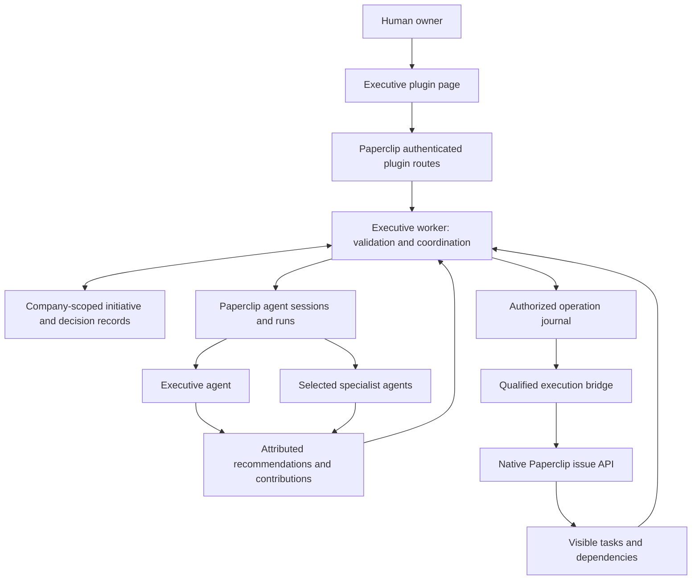

# Paperclip Executive — Technical Architecture Document

Version: 0.1 — September 30, 2026.

Status: proposed architecture derived from PRD 0.1; not an implemented or qualified system.

## 1. Authority, scope, and baseline

The [PRD](PRD.md) owns product requirements. This TAD proposes how to deliver B01
(executive advice on demand) and B02 (scoping and tracking an authorized initiative).
The [roadmap](ROADMAP.md) preserves later scenarios; none is activated by this design.
Open PRD decisions remain open unless explicitly identified below as technical
recommendations. No agents, services, credentials, or runtime configuration were
created to produce this document.

Source baseline:

| Source | Examined revision or fingerprint | Evidence boundary |
| --- | --- | --- |
| Executive repository | `a8deee6a5a9fe10b71d80e74a96adcc07c40a47b`, branch `main` | Authoring baseline: README and MIT license tracked; PRD and roadmap were untracked inputs. Their fingerprints below identify the versions included with this TAD. |
| PRD 0.1 | SHA-256 `8b11a68ce72ac5f94065464fd8695dfafb10c287de8a82b062de494abb2acee9` | Product input, not implementation evidence. |
| Roadmap 0.1 | SHA-256 `91160d4937682987f2089f6201c1aa8b196d8641f7c6b4391a4bcf0e6a178215` | Prioritization input, not delivery commitments. |
| Paperclip | `61b3fd57a695614dc4a37e2303f426a34a9795cf` | Local tracked source examined. Existing modified lockfile and untracked Council prototype/reports were not used as runtime proof. |
| OpenExecutive | `13da433bc6f3ae97e78bb8c90f06bb5e49953447` | Public source, including profiles and orchestration; no upstream application executed. |

Throughout this document, **observed** means supported by the inspected source,
**proposed** means an Executive design choice, and **qualification required** means
the intended behavior must still be demonstrated on an explicitly authorized target.
No claim is made about the version or configuration of a running Paperclip instance.

## 2. Architectural decisions

All decisions below are proposed for this TAD version.

| ID | Decision | Reason and trade-off | PRD trace |
| --- | --- | --- | --- |
| AD-01 | Build an external TypeScript Paperclip plugin with a worker, manifest, and small React UI. | Fits the native plugin contract; avoids importing the Python application and operating another backend. | B01, B02, EXE-12 |
| AD-02 | Execute model work through visible Paperclip agents and sessions. | Preserves agent identity, host execution, and usage records; requires asynchronous result handling and recovery. | EXE-02, EXE-08, EXE-12 |
| AD-03 | Separate model recommendations from deterministic authorization and dispatch. | Model output can request work but cannot grant authority or commit acceptance. | EXE-03, EXE-05, EXE-10 |
| AD-04 | Keep Executive coordination state in a company-scoped plugin database namespace; keep actual work in native Paperclip issues. | Supports precise revisions and recovery without creating a competing hidden task system. | EXE-04, EXE-06, EXE-08 |
| AD-05 | Use revision checks and a durable operation journal, with readback after host effects. | There is no observed transaction spanning plugin state and host operations; uncertain outcomes must remain recoverable. | EXE-05, EXE-08, EXE-09 |
| AD-06 | Prefer native authenticated issue routes for delegated business mutations; do not substitute privileged SDK writes on refusal. | SDK and HTTP mutation paths do not have demonstrated authorization parity. The execution bridge is a qualification gate. | EXE-05, EXE-06 |
| AD-07 | Start with explicit context packets and selected ported methods, without a vector database. | Sufficient candidate for bounded H1; does not reproduce upstream RAG or memory automatically. | EXE-01, EXE-02, EXE-08, EXE-11 |
| AD-08 | Provision selected managed profiles separately from configuration and activation; preserve customizations. | Managed resources support native visibility, while reset can replace operator choices. | EXE-11, EXE-12 |
| AD-09 | Use a plugin page for advice, initiative state, and owner decisions, with links to native work. | Provides explicit decision controls and visibility without building a full project management interface. Surface choice remains subject to product review. | EXE-03, EXE-04, EXE-09 |
| AD-10 | Keep H1 manual and Council-independent. | Avoids importing scheduler, alerting, external delivery, or supervision contracts before their roadmap scope is selected. | B01, B02, EXE-07 |

Rejected starting points: the full OpenExecutive backend; an invisible model loop
inside the plugin worker; a meeting of every specialist for every request; a prompt
as the sole permission boundary; and treating an issue's `done` state as acceptance
of the initiative's business outcome.

## 3. Components and ownership

| Component | Owns | Does not own |
| --- | --- | --- |
| Plugin UI | User interaction, explicit choices, accessible status and contribution views. | Authentication decisions, secrets, authoritative state transitions. |
| Worker | Payload validation, orchestration, context selection, mandate checks, operation correlation, durable state. | Provider SDK calls, invented user identity, native task execution rules. |
| Executive agent | Scoping, selective consultation requests, synthesis, recommendations. | Permission grants, journal transitions, owner acceptance. |
| Specialist agents | Domain analyses against supplied context, attributable limitations and disagreement. | Autonomous fan-out, initiative mutation, owner decisions. |
| Execution bridge | Exact authorized native operations under an identified actor/run, followed by readback. | General administrator access, direct core-table writes, recovery through a more privileged identity. |
| Paperclip host | Authentication, native permissions, agent execution, issue lifecycle, persistence infrastructure, budgets. | Executive-specific mandate semantics or the meaning of an initiative's outcome. |

The execution bridge is a proposed deterministic helper used within an authorized
Paperclip agent run, not a claim that a new native SDK service already exists. The
selected coordinating agent may supply that run identity; no additional permanent
service agent is required by this design. Its transport and containment must pass G01.

Paperclip plugins are trusted code, and plugin UI runs in the host origin. Manifest
capabilities restrict host calls but are not a security sandbox for arbitrary worker
or UI code. Installation therefore remains an explicit trust decision [PC01].

## 4. Native contracts and their limitations

| Concern | Observed contract | Architectural consequence |
| --- | --- | --- |
| Packaging | External package with `paperclipPlugin` metadata, manifest and worker; UI optional in the platform. | Use the native scaffold/build conventions later; package names and release version are not set by this document. |
| Managed resources | Manifest agents, skills, projects, and routines; stable-key `get`, `reconcile`, and `reset`. | Use only selected agents/skills for H1; bind an authorized existing project rather than creating one by default. |
| Agent sessions | `create`, `list`, `sendMessage`, `close`; send returns a `runId`, events arrive asynchronously. | Store correlation before dispatch; persist terminal results rather than relying on the live stream. |
| Session identity | Host session lookup uses the `plugin:<pluginKey>:session:` task-key prefix. | Preserve that prefix in any deterministic task key; do not assume an arbitrary key remains discoverable. |
| Session close | Current host code deletes the session row. | Closing is neither run cancellation nor a durable conversation archive. |
| Plugin routes | Declared routes under `/api/plugins/:pluginId/api/*`, authenticated actor and resolved company supplied by host. | Use host actor context, never actor IDs from model output or request bodies. |
| Database | `ctx.db.query` permits restricted reads; `execute` permits one namespace-local mutation statement and returns row count. | No assumed worker transaction API, runtime DDL, or mutation of public tables. Use conditional single-row updates. |
| Work | Native issues support project/goal/parent references and blocker relations. | Link execution work to the initiative; preserve native assignment and checkout rules. |
| Assignment preview | `authorization.policies.previewAssignment` provides an authorization explanation. | Useful preflight, not an atomic grant or substitute for enforcement at mutation time. |
| Documents | Issue document upsert creates a revision; the inspected SDK signature has no expected-revision argument. | Do not use this SDK call as the authoritative compare-and-swap decision store. |
| Recovery reads | `heartbeat_runs` is an allowed core-read table; run records include status, result and context fields. | Narrow reads may support recovery; result extraction is adapter-specific and must be qualified. |

Sources: [PC01], [PC02], [PC03], [PC04], [PC05], [PC06].
The current SDK's issue update method does not expose the full HTTP execution-policy
contract. The host SDK handler calls the issue service directly, whereas native
routes contain additional authorization and transition logic. This establishes a
contract difference, not a proven bypass. No Council acceptance path is selected here.

## 5. Data model and consistency

### 5.1 Ownership of records

Propose two plugin-owned tables: `company_settings` and `contexts`. Both use explicit
company identifiers; the host namespace separates plugins, not companies. No
cross-company query is permitted without a validated company predicate.

`company_settings` binds the owner identity, selected native agent IDs and profile
versions, permitted project IDs, adapter qualification records, and configured
resource limits. It stores references, never provider credentials. Updates require
the authorized owner and an expected revision.

`contexts` is the authoritative coordination aggregate. Proposed columns include
`company_id`, `context_id`, `creation_request_key`, `kind`, `revision`, `schema_version`,
`payload`, and timestamps. The primary key includes company and context; a unique
company/request-key constraint makes initial creation replayable. `kind` is `advice`
or `initiative`: B01 creates no native execution task merely to store a conversation.
An explicit B01-to-B02 conversion creates a linked initiative and preserves the advice.

The aggregate payload contains these logical records:

| Record | Required content |
| --- | --- |
| Brief versions | Objective, problem, sources, expected outcome, measures, unknowns, scope, exclusions, criteria and content hash. |
| Mandate versions | Verified author, scope, allowed operations/resources/actors, limits, expiry if applicable, escalation recipient, revision and revocation state. |
| Consultations | Question, selected profile/agent, input revision/hash, session/run IDs, attempt, status, contribution, evidence references and limitations. |
| Recommendations | Attributed synthesis, options, assumptions, dissent, referenced contribution versions and source versions. |
| Decisions | Actor from trusted context, type, rationale, exact subject/version/hash, timestamp and supersession links. |
| Work links | Native company/project/issue IDs, operation key, intended assignment, observed state and readback timestamp. |
| Operations | Stable operation ID, payload hash, mandate revision, actor/run, state, host references and reconciliation evidence. |
| Observations | Measured outcome, provenance, observation time, reference to the relevant criterion; unknown values stay explicit. |
| History | Append-only logical transition records retained with the aggregate. Corrections append and supersede; they do not silently rewrite prior decisions. |

Acceptance targets a result version and evidence set, not a mutable title or the
latest conversation text. A new result version requires a new acceptance decision.
History is auditable application data, not cryptographically immutable storage;
hashes identify content but do not prove who authorized it.

Keep coordination lifecycle separate from outcome assessment. Proposed initiative
states are `draft`, `awaiting_authorization`, `authorized`, `active`, `blocked`,
`suspended`, `review_pending`, `accepted` and `abandoned`. Owner commands authorize,
suspend, abandon, resume or accept; observed dispatch and results advance operational
states. Resumption revalidates the mandate and unresolved operations. Correction
creates a new version requiring the applicable authorization and review. Outcome
assessment remains independently `unknown`, `partially_observed`, `met` or `not_met`,
supported by evidence. Owner acceptance cannot turn an unmeasured outcome into `met`.
Advice has its own request/consultation/completion states and never acquires an
initiative mandate by changing a status field.

### 5.2 Atomic local updates

For H1, update an aggregate snapshot, its operation journal and history together
using one parameterized conditional `UPDATE` with company, context and expected
revision predicates; increment the revision in the same statement. Zero affected
rows means conflict, not success. A caller rereads before preparing another update.
Do not overwrite a newer mandate or accept against a stale result version.

This deliberately avoids assuming an SDK transaction across several tables. Settings
and context updates are not jointly atomic: authorization-sensitive settings are
rechecked before dispatch, with changes and already-started actions exposed. The
exact SQL shape and row-count behavior require qualification against the pinned host.

Keep bounded transcripts and structured evidence references rather than raw run logs
inside the aggregate. Enforce configured size and history limits before accepting
more work; report capacity reached instead of silently dropping history. Numerical
limits must be selected during G04. Large-scale archival or normalized history is
outside H1 and would require an explicit storage revision.

### 5.3 Crossing the host boundary

There is no atomic transaction between the plugin aggregate and session creation,
agent execution, or issue mutation. Use a durable journal with the proposed states:

`prepared → authorized → dispatching → observed_success | observed_failure | outcome_unknown`

The worker records an operation before dispatch, claims it through the revision
check, and records returned IDs and readback. Repeating a request with the same key
and payload returns the recorded operation; reusing the key for a different payload
is rejected. A crash after dispatch leaves an uncertain operation, not permission
to send it again. A worker lease expiry alone never proves a host action failed.

Use native issue-creation idempotency keys where supported and tested [PC07]. Do not
generalize that guarantee to session sends, assignment updates or all host APIs.
An ambiguous operation is reconciled from actual host state or escalated; it blocks
dependent actions. No exactly-once execution guarantee is claimed.

## 6. Authentication and delegation enforcement

### 6.1 Owner commands

Owner-facing routes use `auth: board` and explicit company resolution. The worker
additionally checks the bound owner identity for delegation, acceptance, suspension,
settings and profile-management commands. Missing or ambiguous user identity fails
closed; a local operator context without an attributable user requires a separately
qualified identity binding, not a fabricated owner ID.

Request bodies may identify an expected revision or target resource, but never set
the authenticated author. All targets are resolved again within the current company.
Company membership alone must not be treated as ownership of every initiative.

### 6.2 Model and specialist boundaries

Model outputs are untrusted proposals. Validate schemas, allowed enum values,
resource IDs, lengths, source references and version bindings. Models cannot set
the owner, grant permissions, expand a mandate, or mark their contribution accepted.
Supplied documents and retrieved text are evidence, not executable instructions.

The worker constructs a minimum context packet for each specialist: the question,
relevant facts and sources, initiative constraints, relevant decisions, output
contract, and explicit unknowns. It excludes unrelated initiatives and confidential
material outside that profile's authorized context.

Paperclip configuration and the selected adapter must also restrict direct reads,
writes, filesystem access and outbound access where the profile requires it. Prompt
prose and a small context packet do not prove isolation. Qualification must exercise
both plugin-mediated operations and direct native/tool access; unavailable containment
is a release blocker for the affected authority claim, not an undocumented exception.

### 6.3 Business mutations

Use a deterministic helper in an authorized coordinating run to perform exact
operations through the native authenticated API. The helper receives an operation
reference, retrieves the canonical authorized payload, and checks the current
mandate and claim before dispatch. It must not accept arbitrary URLs, shell text,
SQL, actor IDs, or replacement payloads from an agent.

For supported local runs, Paperclip documents injected run identity and short-lived
authentication, plus run attribution on issue mutations [PC08]. Keep those credentials
inside their native execution environment; do not relay them through the browser,
model prompt, plugin ledger or logs. Other adapters require their own verified path.
No provider, engine or model is selected by this transport preference.

The core route must authorize the actual actor, assignment and lifecycle transition.
A denied operation stays denied. Do not retry via SDK issue writes, direct database
access, board impersonation or a different credential. The plugin records both the
owner's delegation and the agent/run that actually executes the action.

This helper, its scoped claim route and its runtime containment are **proposed
Executive components**. The existing sources do not prove an atomic mandate check
inside every native API mutation. G01 must establish the covered path and reject
unauthorized alternate paths before B02 execution is enabled. A proposal-only mode
remains useful but does not satisfy the full B02 qualification criterion.

### 6.4 Suspension and revocation

Revocation prevents new operation claims and new consultations; every subsequent
dispatch rechecks the mandate. An already claimed or dispatched operation is shown
as in flight until its effect is reconciled. A revocation racing an external write
does not retroactively cancel that write. Do not equate session close with run stop,
or agent pause with cancellation of work already running.

Use a supported run-control path only after qualification; otherwise expose the
remaining run and request the native operator action. Historical decisions and
observed effects remain available after suspension or abandonment.

## 7. Agent orchestration and journeys

### 7.1 Output contracts

Define versioned structured outputs for `clarification`, `consultation_plan`,
`contribution`, `recommendation`, `initiative_proposal` and `work_proposal`.
Each carries its context/input revision and source references. Contributions include
author attribution from the host run, assumptions, limitations and dissent; proposals
reference valid resources but never constitute authorization.

Parse and validate the complete terminal output. Streaming fragments are display-only.
Malformed output remains failed or incomplete. A bounded correction attempt may be
allowed within configured limits; exhausted limits surface a useful partial result
or blocker rather than an unlimited repair loop.

### 7.2 B01 flow

1. Persist the owner's request and input references as an advice context.
2. Invoke the Executive profile through a tracked session. It may answer directly,
   request clarification, or propose a bounded consultation plan.
3. Validate that plan against selected profiles, permitted context and request limits.
   Only the worker dispatches specialist calls; specialists do not recursively fan out.
4. Persist each attributed contribution or failure independently in the context.
5. Ask Executive to synthesize only the available contributions. Preserve dissent
   and identify missing expertise rather than presenting false consensus.
6. Publish the persisted recommendation in the UI. Do not create an initiative or
   native work unless the owner explicitly requests B02.

A provider call per specialist is not necessarily required for every request.
The maximum number of consultations, synthesis attempts and concurrent runs must be
configured; hierarchy depth does not establish a need for more agents.

### 7.3 B02 flow

1. Create an initiative context from an explicit request or linked advice context.
2. Use the scoping and consultation flow to prepare a versioned brief and work proposal.
3. The owner authorizes a specified brief and delegation envelope through a dedicated
   command. A chat sentence interpreted by a model is not the authorization record.
4. The worker prepares operations for the qualified bridge. Resolve an existing
   authorized project; do not create a project, goal or new agent implicitly.
5. Create ordinary execution tasks with correlation/idempotency keys, required plan
   content, intended assignees and real dependencies through the native contract.
   Read back the created work and assignment before reporting that coordination occurred.
6. On manual refresh or review, fetch current authorized work/evidence. Executive
   compares observed outcomes with the brief; neither task completion nor an agent's
   favorable synthesis accepts the initiative.
7. The owner accepts an exact result/evidence version, requests a correction, suspends,
   or abandons. Corrections preserve links to prior versions and decisions.

The initiative is a plugin coordination record, not automatically a parent issue.
Do not create a blocker on a conversational record. Where native conversation tasks
are used, follow Paperclip's handoff rules: ordinary execution tasks, plan supplied
at creation and no parent/blocker relationship back to the conversation [PC08].
An explicit native goal may be linked, but H1 does not create or claim achievement
of a goal merely from a recommendation.

### 7.4 Session recovery

Store context, operation and attempt identifiers in session task keys and prompts,
without secrets. The observed session implementation forwards live events and
removes subscriptions on disposal; it exposes no session-event replay API [PC03].
Terminal events can be missed around dispatch or restart, so absence of an event
never means the model failed or should be reinvoked.

Use exact company/agent/run correlation to inspect permitted `heartbeat_runs`
fields via a narrow allowlisted read when recovering. A known successful run still
needs a validated final contribution: adapter `result_json` and stdout excerpts are
not assumed interchangeable. Test the selected adapter's completion format before
enabling automatic recovery. If an ID was lost, reconcile exact context/session
correlation; multiple matches remain ambiguous.

The session list exposes neither task keys nor last-run identifiers [PC02, PC03].
If session creation succeeds but its returned ID is lost before any run exists,
the current SDK and permitted core reads cannot reliably recover that session.
Keep the operation outcome unknown and require explicit reconciliation; do not
infer identity from list order or blindly repeat creation.

Persist recovered output before synthesis; do not rerequest model work solely to
rebuild UI text. Manual resume is the H1 control surface. Recovery on worker startup
may reconcile state but must not silently restart business actions. UI streams are
optional acceleration; durable reads remain the source of truth.

## 8. Porting profiles and reusable methods

The proposed source-to-destination map is prospective. These files do not exist yet.
All upstream paths below are relative to `packages/core/openexecutive/` at the
OpenExecutive revision in section 1.

| Candidate | Upstream inputs | Proposed destination and adaptation | Missing equivalence |
| --- | --- | --- | --- |
| Executive | `prompts/executive_persona.py`, `prompts/cache_manager.py`, `orchestrator/executive.py`, `orchestrator/router.py` | `profiles/executive/AGENTS.md` plus worker contracts; retain scoping/synthesis, remove fictional credentials, automatic external sending and hidden-contributor instructions. Native role `general` proposed. | Python routing loop, memory, tools and scheduler are not ported by copying the persona. |
| CSO | `agents/strategy.py`, `CSO_PROMPT` in `prompts/domain_prompts.py`, selected strategy knowledge | `profiles/strategy/AGENTS.md`; explicit assumptions, strategic options and reserved owner decisions. Native role `general`. | RAG, market data and outcome quality require separate evidence. |
| CPO | `agents/product.py`, `CPO_PROMPT`, `knowledge/builtin/skills/product/feature-prioritization.md` | `profiles/product/AGENTS.md` and a selected prioritization skill; title CPO, native role `pm`. | Product evidence, valid scoring inputs and independent acceptance are not supplied by the role. |
| COO | `agents/operations.py`, `COO_PROMPT`, selected operations knowledge | `profiles/operations/AGENTS.md`; coordination proposals and explicit permissions. Native role `general`. | Actual assignment, capacity and dependency handling require the qualified native path. |

Role identifiers are constrained by the host schema; titles are separate. Avoid
automatically choosing `ceo` for Executive, because that native role has special
permission-management treatment [PC09]. Selection of these four profiles remains
subject to the PRD's reference use case.

Separate durable role instructions, reusable methods, adapter/model configuration,
and initiative context. An initial method set can adapt feature prioritization and
relevant portions of upstream review/scoping material; distinguish copied material,
adaptations and newly authored procedures. Do not imply that all three are upstream.
The weekly review method, if selected, supports manual review only in H1.

Package only reviewed knowledge needed by the selected methods. Explicitly handle
missing company context, dated heuristics and jurisdiction-sensitive claims. Do not
import the external corpus, ChromaDB, Honcho or provider defaults as hidden dependencies.
Maintain a port map with upstream path/revision/hash, destination, license, changes,
functional dependencies and unreproduced capabilities. Preserve Apache-2.0 and
relevant NOTICE content, mark derived-file changes, and add README attribution once
materials are actually incorporated. Keep the existing project license decision separate.

## 9. Plugin surface and capabilities

Proposed package areas: `src/manifest.ts`, `src/worker.ts`, `src/domain/`,
`src/persistence/`, `src/paperclip/`, `src/ui/`, `profiles/`, `skills/`,
`migrations/`, and a provenance manifest. This is a layout recommendation, not scaffolding.
Use the native SDK snapshot compatible with the examined host. An npm version string
alone is insufficient to establish compatibility with that source revision.

| Capability group | Proposed use | Boundary |
| --- | --- | --- |
| `api.routes.register` | Company-scoped owner commands, state reads, and narrowly authenticated operation claims/results. | Board-only owner decisions; agent routes verify exact permitted agent/run/operation. |
| `agents.read`, `agents.managed`, `skills.managed` | Inspect bindings and perform explicitly requested provisioning. | Setup is a separate action; no automatic hire on advice submission. |
| `agent.sessions.create`, `.list`, `.send` | Tracked Executive/specialist consultations. | Only configured agents; activation and budgets checked before dispatch. |
| `database.namespace.migrate`, `.read`, `.write` | Durable plugin aggregates and revision checks. | No public-table writes; explicit company predicates. |
| `issues.read`, `projects.read`, `goals.read` | Inspect authorized context and native work. | Worker additionally limits reads to the initiative's allowed resources. |
| `issue.documents.read`, `issue.relations.read` | Obtain evidence and blockers. | No generic document browsing beyond authorized context. |
| `authorization.policies.read` | Explain assignment preflight. | Does not authorize an operation or grant privileges. |
| `ui.page.register`, `ui.sidebar.register` | Advice, initiative and readiness views in the host. | No arbitrary host navigation or unrelated UI extension. Live streaming is optional; durable reads remain authoritative. |

Initially allowlist only `heartbeat_runs` for database core reads, subject to recovery
qualification. Fetch work through native read services. Do not request generic
outbound HTTP, secret access, grant/policy writes, direct issue mutation capabilities,
agent creation tools, routine scheduling or global agent pause/resume merely for convenience.
Profile provisioning and later activation remain separate supported operator workflows.

Proposed command names such as `submitAdvice`, `proposeInitiative`, `authorizeMandate`,
`requestReview`, `acceptResult`, `suspendInitiative` and `resumeInitiative` are
Executive-owned interfaces, not existing Paperclip endpoints. Every mutating command
requires an idempotency key and expected context revision where a context exists.
Agent claim/result interfaces are narrower than owner commands and must verify native
run provenance before accepting a result. Their route declarations and runtime
authentication are part of G01, not an assumed inherited capability.

## 10. User interface and lifecycle

Propose one plugin page with advice and initiative views. It shows the current brief,
next required decision, mandate, work links, contributions, evidence and history.
Owner controls display the exact version and consequences of authorization or
acceptance. A correction edits a new draft version, not an accepted historical record.

Use the host's shared components where appropriate and preserve native navigation.
Do not render model-generated HTML or derive execution commands from rendered text.
Persist before reporting success; stale revisions produce a refresh-and-review state.
Keyboard navigation, focus handling, named controls, textual status labels and usable
error states are acceptance requirements. Mobile layout and product languages remain
open PRD choices; the TAD does not silently set them through its use of English.

Installation and readiness sequence, for a later authorized operation:

1. Validate package, capabilities, migrations and port attribution; build reproducibly.
2. Install on an identified compatible host and inspect plugin/worker health.
3. Bind company, owner, resources and selected profiles through explicit setup.
4. Reconcile only selected resources; keep agents paused or pending approval as required.
5. Configure and verify adapter, engine, model, effort, authentication, permissions and limits.
6. Assign company skills through supported synchronization and verify actual runtime loading.
7. Activate selected agents explicitly and qualify B01, then the gated B02 execution path.

Reconcile is not defaults synchronization: it generally retains existing content.
Reset can replace instructions, identity and adapter/runtime/permission defaults
[PC10]. Upgrades must compare shipped, previously applied and current custom content;
surface conflicts and apply reviewed changes rather than resetting all profiles.

Database migrations are checksummed by the host. Use additive migrations and test
recovery from failure; do not modify already-applied migration files. Plugin disablement
must stop new dispatch but does not imply cancellation of running agents. Backup and
restore the plugin namespace together with relevant host records; do not claim a
package downgrade rolls back decisions or external effects. No deletion policy is
implemented by this document; retention/export limits require an owner decision.

## 11. Observability, limits, and failure handling

Record company/context/operation IDs, mandate and input revisions, agent/run IDs,
profile/skill versions, transition times, failure categories and readback references.
Correlate plugin activity with host runs without forging human attribution. Avoid
logging credentials, full confidential prompts or unrestricted provider payloads.

Track consultation count, elapsed time, available usage/cost data, repair attempts,
human decisions and coordination overhead. Unknown cost is not zero. Host budgets
and configured run timeouts are complementary controls, not proof of an initiative's
total spend or end-to-end latency. Unknown required limits prevent activation of
the affected operation; numeric limits remain part of G04.

| Failure | Required behavior |
| --- | --- |
| Duplicate request or concurrent edit | Return the correlated result or conflict; do not duplicate work or overwrite a newer decision. |
| Model/provider error or malformed output | Preserve attributable failure; bounded repair or limited response within remaining authority. |
| Missing terminal event | Reconcile persisted run state; do not blindly rerun. |
| Permission refusal | Record denied state and explanation; never change transport or identity to bypass it. |
| Host mutation succeeds but ledger update fails | Preserve uncertain operation; correlate and read back before recording success or considering retry. |
| Partial work creation | Show each confirmed issue and unresolved operation; resume only missing authorized work. |
| Mandate withdrawn during execution | Stop new claims, expose in-flight effects and qualified stop options. |
| Source or result changes after acceptance | Mark the new version unaccepted; retain the historical decision on the old version. |
| Deleted or inaccessible native evidence | Keep a tombstone/reference and mark evidence unavailable; do not infer success. |
| Profile/skill mismatch or update conflict | Mark readiness incomplete and retain customization until a reviewed resolution. |

## 12. Validation and release gates

No runtime tests were executed for this documentary task. The checks below specify
future evidence, not completed qualification.

| Gate | Evidence required | Blocks |
| --- | --- | --- |
| G01 — Identity and authority | Real owner/agent/run attribution; authorized native create/assign/readback; rejected out-of-mandate and direct alternate writes; denied SDK fallback; revocation races and least-privilege runtime containment. | B02 mutation activation and any broad authority/isolation claim. |
| G02 — Durable execution | Real session dispatch/result collection, restart with missed events, exact run recovery, duplicate/concurrent commands and ambiguous operation handling. | B01/B02 readiness and continuity claims. |
| G03 — Profile and port fidelity | Selected upstream-to-profile map, license/notices review, preserved customizations, actual skills/configuration/runtime readback. | Claims of functional porting and usable profiles. |
| G04 — Product and operating envelope | Owner-selected reference case, delegation scope, data/classification and retention rules, compatible host/adapter, limits and usefulness thresholds. | Production activation and product acceptance. |

Tests should progress from deterministic contract tests to an explicitly authorized
disposable host and then a bounded real-agent journey. Use mocks for parser/state
logic only; do not use mock success as authority or lifecycle proof. Do not install
dependencies, create an instance, call business models or activate agents under this
document-authoring authorization.

| PRD requirement | Architecture coverage | Necessary validation |
| --- | --- | --- |
| EXE-01 | Structured clarification and brief versions; AD-03/07. | Vague objective yields decisive questions and no delivery claim. |
| EXE-02 | Consultation plan, per-run contributions and dissent; AD-02/03. | Selective routing, direct answer, disagreement and unavailable specialist. |
| EXE-03 | Advice contexts distinct from initiatives; AD-03/04. | Advice produces no operational commitment or work creation. |
| EXE-04 | Versioned brief with measures and unknowns; AD-04. | Missing targets remain explicit; proposal is inspectable. |
| EXE-05 | Owner mandate, native authenticated bridge and gates; AD-03/05/06. | G01 authorization, refusal, stale mandate and alternate-path tests. |
| EXE-06 | Journal, idempotent native creation and work readback; AD-04/05/06. | Actual assignments and dependencies match the authorized proposal. |
| EXE-07 | Observations distinct from task state and acceptance; AD-04/10. | Completed tasks with unmeasured effect remain outcome-unknown. |
| EXE-08 | Durable aggregate, input snapshots and run recovery; AD-02/04/05. | Restart and manual resume preserve decisions without blind replay. |
| EXE-09 | Revocation, suspension and versioned correction; AD-05/06/09. | No new claims after revocation; in-flight effects and revisions remain visible. |
| EXE-10 | Company predicates, owner/run checks and runtime containment; AD-03/06/07. | Cross-company and unauthorized-context attempts fail across covered paths. |
| EXE-11 | Port map and reviewed profile migrations; AD-07/08. | Actual derived content is attributed and custom content survives an update. |
| EXE-12 | Readiness ladder and evidence per resource; AD-02/08. | Installed/configured/loaded/activated/executed evidence remains distinct. |

## 13. Remaining decisions and next technical step

The recommended starting architecture is an external plugin using native agents,
explicit context, a durable coordination record and a qualified native mutation
path. This is technically concrete enough for review, but not approval to start
implementation or a claim that all necessary enforcement already exists.

Before decomposition into implementation work, confirm the reference initiative,
initial delegation, selected profiles and interaction surface. Resolve G01's bridge
and containment feasibility first, alongside G02's selected-adapter result recovery.
If the host cannot support the required boundary, report the missing contract and
seek an explicit architecture/product decision; do not silently reduce the PRD or
expand the work to modify Paperclip core.

Council integration, recurrence, connectors, additional executives and vector
retrieval stay in the roadmap. No Council API, external delivery control or
general learning mechanism is specified as an available dependency here.

## 14. Source references

Paperclip links are pinned to the source revision in section 1. These are source
contracts, not a deployed-instance audit. The native authoring guide is used over
the prospective `PLUGIN_SPEC.md`; the skill's older claim that shared UI components
are absent is contradicted by the examined guide and SDK exports.

- PC01: [Plugin authoring guide](https://github.com/paperclipai/paperclip/blob/61b3fd57a695614dc4a37e2303f426a34a9795cf/doc/plugins/PLUGIN_AUTHORING_GUIDE.md) — trusted code, packaging, database, routes, managed resources and UI.
- PC02: [SDK types](https://github.com/paperclipai/paperclip/blob/61b3fd57a695614dc4a37e2303f426a34a9795cf/packages/plugins/sdk/src/types.ts) — database client, issue documents, issue mutations, sessions and authorization preview.
- PC03: [Host session implementation](https://github.com/paperclipai/paperclip/blob/61b3fd57a695614dc4a37e2303f426a34a9795cf/server/src/services/plugin-host-services.ts#L3220) — session prefix, wakeup, live events, disposal and close semantics.
- PC04: [Database service](https://github.com/paperclipai/paperclip/blob/61b3fd57a695614dc4a37e2303f426a34a9795cf/server/src/services/plugin-database.ts#L245) — restricted single statements and namespace validation.
- PC05: [Scoped API route checks](https://github.com/paperclipai/paperclip/blob/61b3fd57a695614dc4a37e2303f426a34a9795cf/server/src/routes/plugins.ts#L608) and [request actor shape](https://github.com/paperclipai/paperclip/blob/61b3fd57a695614dc4a37e2303f426a34a9795cf/packages/plugins/sdk/src/define-plugin.ts#L160).
- PC06: [Allowed core tables](https://github.com/paperclipai/paperclip/blob/61b3fd57a695614dc4a37e2303f426a34a9795cf/packages/shared/src/constants.ts#L1438) and [persisted run fields](https://github.com/paperclipai/paperclip/blob/61b3fd57a695614dc4a37e2303f426a34a9795cf/packages/db/src/schema/heartbeat_runs.ts).
- PC07: [Native issue routes](https://github.com/paperclipai/paperclip/blob/61b3fd57a695614dc4a37e2303f426a34a9795cf/server/src/routes/issues.ts), [issue validators](https://github.com/paperclipai/paperclip/blob/61b3fd57a695614dc4a37e2303f426a34a9795cf/packages/shared/src/validators/issue.ts#L769), and [SDK host mutation path](https://github.com/paperclipai/paperclip/blob/61b3fd57a695614dc4a37e2303f426a34a9795cf/server/src/services/plugin-host-services.ts#L1916).
- PC08: [Native Paperclip operational skill](https://github.com/paperclipai/paperclip/blob/61b3fd57a695614dc4a37e2303f426a34a9795cf/skills/paperclip/SKILL.md) — run authentication, attribution and conversation handoff.
- PC09: [Native roles](https://github.com/paperclipai/paperclip/blob/61b3fd57a695614dc4a37e2303f426a34a9795cf/packages/shared/src/constants.ts#L46) and [permission-management route](https://github.com/paperclipai/paperclip/blob/61b3fd57a695614dc4a37e2303f426a34a9795cf/server/src/routes/agents.ts#L4943).
- PC10: [Managed agent reconciliation and reset](https://github.com/paperclipai/paperclip/blob/61b3fd57a695614dc4a37e2303f426a34a9795cf/server/src/services/plugin-managed-agents.ts#L626).
- PC11: [SDK UI exports](https://github.com/paperclipai/paperclip/blob/61b3fd57a695614dc4a37e2303f426a34a9795cf/packages/plugins/sdk/src/ui/index.ts) and [capability mapping](https://github.com/paperclipai/paperclip/blob/61b3fd57a695614dc4a37e2303f426a34a9795cf/packages/plugins/sdk/src/host-client-factory.ts).
- OE01: [Domain prompts](https://github.com/SenteLabsAI/OpenExecutive/blob/13da433bc6f3ae97e78bb8c90f06bb5e49953447/packages/core/openexecutive/prompts/domain_prompts.py), [Executive persona](https://github.com/SenteLabsAI/OpenExecutive/blob/13da433bc6f3ae97e78bb8c90f06bb5e49953447/packages/core/openexecutive/prompts/executive_persona.py), and [router](https://github.com/SenteLabsAI/OpenExecutive/blob/13da433bc6f3ae97e78bb8c90f06bb5e49953447/packages/core/openexecutive/orchestrator/router.py).
- OE02: [Built-in knowledge and methods](https://github.com/SenteLabsAI/OpenExecutive/tree/13da433bc6f3ae97e78bb8c90f06bb5e49953447/packages/core/openexecutive/knowledge/builtin), [license](https://github.com/SenteLabsAI/OpenExecutive/blob/13da433bc6f3ae97e78bb8c90f06bb5e49953447/LICENSE), and [NOTICE](https://github.com/SenteLabsAI/OpenExecutive/blob/13da433bc6f3ae97e78bb8c90f06bb5e49953447/NOTICE).
